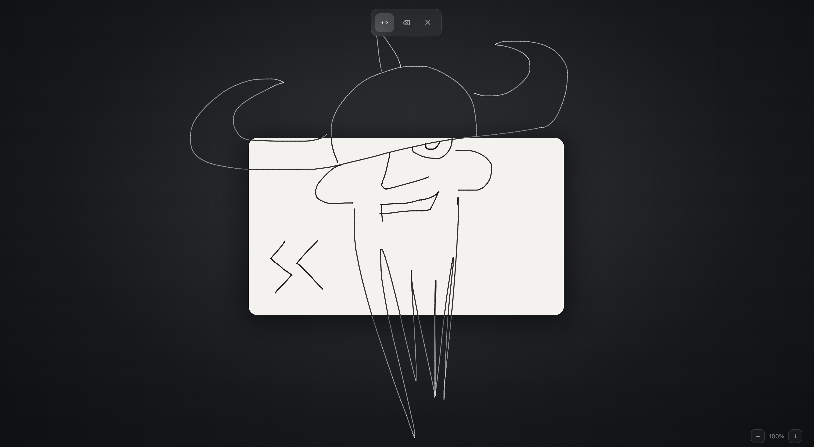

# SagaCanvas 🔷 Beta

> A free-form storyboarding canvas that doesn't tell you where to draw.

---

## 🔷 What makes this different

Most storyboarding tools lock you into a grid of fixed frames, a timeline, or a sequence of slides. They decide the structure for you. SagaCanvas starts from the opposite assumption: **the interface should never constrain the author.**

You get an infinite dark canvas and a single drawing window — a frame that behaves like a physical piece of film stock lying on a table. Draw inside it and your strokes appear in black. Draw outside and they turn white, waiting in the margins. Resize the window and previously-hidden strokes slide into view, turning black as the frame edge sweeps over them. Nothing is ever lost. The drawing exists on the infinite surface; the frame is just a viewport you move and reshape.

On top of that core, this build adds the structure every real storyboard needs without taking the freedom away: **unlimited layers per scene**, a **filmstrip of scenes** where each shot keeps its own framing and camera, and **undo/redo**. Your shots have names and a sequence when you want them — and the moment the sequence gets in your way, you can ignore it and just draw.

It's still early and in active development. The core frame interaction is worked out; scenes, layers and history are now live; what comes next is saving your work and turning the storyboard into an actual sequence.

---

## ✨ Features

- **Infinite canvas** — draw anywhere; the surface grows as you pan
- **Frame as viewport** — an infinitely visible drawing window on an unbounded surface; ink inside is black, ink outside is white, nothing is ever deleted
- **Scenes / storyboard** — multiple shots, each with its own frame position, size, format and camera; the bottom filmstrip adds scenes (after or before) and switches between them
- **Layers** — unlimited layers per scene; add above or below, switch from the right-hand rail; erasing is layer-safe and never eats into another layer's ink
- **Layer transparency** — drag a layer's eye to fade it in and out; the gesture starts from the layer's *current* opacity and continues from there, so you can resume adjusting from any level it's already at
- **Transparency ring** — a green status outline around the active layer thumbnail: solid at 0% opacity, then a dashed progress indicator that grows clockwise from 12 o'clock up to 100% transparency
- **Zero-gap outline** — the status ring hugs the layer thumbnail tightly with no gap, so it reads as the thumbnail's own border
- **Undo / Redo** — full history per layer; each step undoes one stroke or one clear
- **Move tool** — press-and-hold the move button and drag anywhere: the drawing itself shifts under your cursor, not just the camera
- **Pen and eraser** — two tools, switchable from the toolbar
- **Clear** — wipe the canvas and start fresh
- **Camera pan & zoom** — scroll, two-finger trackpad drag, pinch, or +/− buttons (0.25× to 4×)
- **Frame corner handles** — bottom-right resizes the window; top-right and bottom-left zoom the content inside the frame; top-left snaps the format
- **Format snapping** — 2.39:1, 2.00:1, 1.85:1, 16:9, 1:1, 4:3, 9:16 with elastic rubber-band animation
- **Focus ring** — when the frame drifts off-center, a highlight ring appears; click it to smoothly dock the frame back to the center of the viewport
- **Locate button** — when the frame goes fully off-screen, the pen button glows to signal you can click it to find the frame again

---

## 🚀 Open it

**[▶ lexbayart.github.io/sagacanvas](https://lexbayart.github.io/sagacanvas/)**

No install. No account. Works offline.

Or download `index.html` from this repo and open it locally — fully standalone, works without internet.

---

## 📖 Documentation

- [**Complete User Guide**](docs/GUIDE.md) — tools, layers, scenes, undo/redo, all interactions explained

---

## 🔮 Status & what's being built

The earlier release (v0.2) was a single unlayered frame with no undo. This build is the biggest jump yet: scenes, layers, undo/redo and a grain-panning move tool are already live.

Still in progress:

- **Persistence & export** — right now everything lives in RAM; reloading the page loses your shots, and there's no PNG export yet
- **Director's view** — a top-down scene planning mode where you place lights, cameras, characters and visual annotations as comments on the frames
- **References** — drop in GIFs, images, and script pages alongside your drawings
- **Audio** — attach sound references to frames and scenes
- **Dynamic timeline** — arrange your storyboards into a living sequence for the entire film (secret work in progress)

The philosophy stays the same: the tool follows your process, not the other way around.

---

## 💬 Feedback & Contact

This project is in active development.
Found a bug or have an idea? Reach out:

- **Telegram:** [@lexbay](https://t.me/lexbay)
- **GitHub Issues:** [Open an issue](https://github.com/lexbayart/sagacanvas/issues)

---

## 🛠️ Tech

Vanilla JS · HTML5 Canvas · Zero dependencies · Zero build step · Single HTML file

---

## 📄 License

© 2025 lexbayart — [CC BY-NC 4.0](https://creativecommons.org/licenses/by-nc/4.0/)

Free to use and share for non-commercial purposes with credit.
Commercial use requires explicit permission from the author.